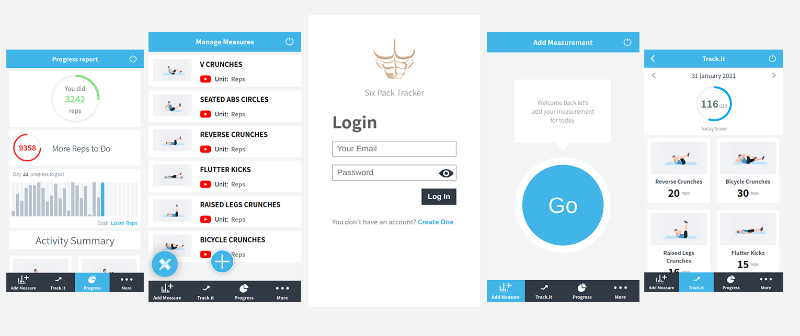

# Six Pack Tracker(Front End)

**This is the final capstone project required by [Microverse](https://www.microverse.org/). After finishing the whole program, they have picked this project for me to prove my technical knowledge in React/Redux and Ruby on Rails, you can find the requirement [here](https://www.notion.so/Final-Capstone-Project-Tracking-App-22e454da738c46efaf17721826841772#2710d5572c59407c90bef34f3cbf53e3)**

> Six Pack Tracker is a 30 days workout app challenge. that, challenges the users to do a certain type of ABS exercises for 30 days, with a repetitions goal for every move in every day. This app also shows to the users their progress to motivate them to do more. You should also not that the app is not responsive for Desktop, you can open it only on mobile or tablet. This repository is the Front End part of the app cause it's a Full Stack Application built using React/Redux and Ruby on Rails. **You can find the Back End repository [here](https://github.com/elmejdki/sixpack-tracker-api).**

## Project Preview:



## Features

- A user can sign up and log in using his email and password.
- A user can add his measurements
- A user can check videos and instructions on the moves that he should do.
- A user can track his progress on the app monthly or daily through the track.it or progress pages.
- A user can see a summary of his measurements.
- The app has a control panel also for editing measures, or exercises that the users should do.
- An admin can add Exercises.
- An admin can Edit Exercises.
- An admin can Remove Exercises.

## Built With

- ReactJS 17,
- ReactDOM 17,
- Redux,
- create-react-app,
- CSS,
- moment.js,
- recharts,
- Babel

## Live Demo

[Live Demo Link](https://sixpacktracker.herokuapp.com/)

## Getting Started

### Prerequisites

In order to have this project up and running you will need:

- NodeJS 10+

### Setup

First, you need to clone this project using one of the links above, using this command:

```Javascript
git clone RESPOSITRY_LINK
```

Then you should run: `npm install`

And afterward, you supposed to run: `npm start`, to run the project in your local machine.

Then head to the localhost on port 8080 `https://localhost:8080`

Remember if you want to connect it with the local Back End Repository open `src/usefull_vars/index.js` and change the host variable to `localhost:3000` 

Congrats the project is fully working.

## Available Scripts

In the project directory, you can run:

### `npm start`

Runs the app in the development mode.\
Open [http://localhost:8080](http://localhost:8080) to view it in the browser.

The page will reload if you make edits.\
You will also see any lint errors in the console.

### `npm test`

Launches the test runner in the interactive watch mode.\
See the section about [running tests](https://facebook.github.io/create-react-app/docs/running-tests) for more information.

### `npm run build`

Builds the app for production to the `build` folder.\
It correctly bundles React in production mode and optimizes the build for the best performance.

The build is minified and the filenames include the hashes.\
Your app is ready to be deployed!

See the section about [deployment](https://facebook.github.io/create-react-app/docs/deployment) for more information.

### `npm run eject`

**Note: this is a one-way operation. Once you `eject`, you can’t go back!**

If you aren’t satisfied with the build tool and configuration choices, you can `eject` at any time. This command will remove the single build dependency from your project.

Instead, it will copy all the configuration files and the transitive dependencies (webpack, Babel, ESLint, etc) right into your project so you have full control over them. All of the commands except `eject` will still work, but they will point to the copied scripts so you can tweak them. At this point you’re on your own.

You don’t have to ever use `eject`. The curated feature set is suitable for small and middle deployments, and you shouldn’t feel obligated to use this feature. However we understand that this tool wouldn’t be useful if you couldn’t customize it when you are ready for it.

## Authors

👤 **Zakariae El Mejdki**

- Github: [@elmejdki](https://github.com/elmejdki)
- Twitter: [@zakariae_elmejdki](https://twitter.com/zakariaemejdki)
- Linkedin: [Zakariae El Mejdki](https://www.linkedin.com/in/zakariaeelmejdki/)

## 🤝 Contributing

Contributions, issues and feature requests are welcome!

Feel free to check the [issues page](https://github.com/elmejdki/sixpack-tracker-frontend/issues).

## Show your support

Give a ⭐️ if you like this project!

## 📝 License

This project is [MIT](lic.url) licensed.